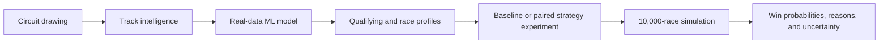

# Apex Race Forecast Lab

[](https://apex-race-lab.vercel.app)
[](https://github.com/dhruvtoprani/f1track/actions/workflows/ci.yml)

Draw a fictional Formula 1 circuit and forecast how often each driver on the 2026 grid wins across 10,000 simulated races.

This is not a scripted “pick a winner” demo. It learns patterns from real OpenF1 race history, studies the circuit you draw, and runs thousands of different race worlds with changing strategy, weather, incidents, reliability, safety cars, and driver execution.

**Links:** [Live product](https://apex-race-lab.vercel.app) · [How it works](#how-the-forecast-works) · [Plain-English math](#the-math-without-the-jargon) · [Model results](#how-well-does-it-perform) · [Run locally](#run-locally)

## What you can do

1. Draw a circuit or load a preset.
2. Set its length, direction, start line, and pit lane.
3. Review the inferred corners, straights, speed profile, tyre stress, passing zones, and similar real tracks.
4. Choose dry, wet, or changing weather.
5. Run a full 2026 qualifying session.
6. Simulate 10,000 races and see every driver's win, podium, points, and DNF probability.
7. Change one team's strategy and compare it with a paired baseline using the same race worlds.
8. See why the leader is favored through grid, track-package, and execution signals.
9. Generate a 1200×630 share card with the exact track, result, conditions, top three, and strategy impact—or resample while keeping the track and starting grid fixed.

The headline result is the driver who wins the largest share of modeled races—not a promise that one exact outcome will happen.

## How the forecast works

The product has four connected layers:



### 1. Track intelligence

The drawing is converted into a smooth racing line. The geometry engine measures curvature, straights, corner speeds, physical length, overtaking opportunities, and how unusual the circuit is compared with real tracks.

### 2. Real-data learning

The shipped model, **APEX T-REK**, was trained on public OpenF1 history from 2023–2026. It learns relationships between driver and team form, qualifying, track characteristics, weather, tyre age, pit behavior, incidents, and race outcomes.

### 3. Race-world simulation

The learned model supplies the starting probabilities and performance profiles. The simulator then creates independent race worlds by varying factors such as strategy, traffic, tyre wear, pit stops, reliability, safety cars, and execution.

The Strategy Lab can change one team's plan while holding the grid, seed, and random race worlds fixed. That paired comparison makes the reported percentage-point change easier to interpret than two unrelated simulations.

### 4. Probability, not certainty

If a driver wins 3,200 of 10,000 modeled races, the dashboard reports a 32% modeled win probability. It also shows a sampling interval so small changes between two 10,000-race samples are not presented as meaningful certainty.

## The math, without the jargon

T-REK is designed around three practical ideas:

- **Recent races matter more.** Older results still help, but their influence gradually fades.
- **One strange race should not control the model.** A robust error function limits the influence of crashes, extreme weather, and unusual outcomes.
- **Pace and reliability are different.** The model learns how a car performs when it finishes, while a separate model estimates its chance of not finishing. This avoids counting a mechanical failure twice.

The core model can be summarized as:

```text
prediction = recent historical baseline + nonlinear context adjustments
```

Those adjustments let the model represent combinations such as a particular driver–team pairing on a high-speed circuit without requiring a large neural network. Every learned number is exported into a small browser-readable artifact, so the Python training model and the website run the same calculation.

For the formal equation and training details, see the [model card](./ml/MODEL_CARD.md).

## How well does it perform?

On this project's real-data holdout, T-REK beat a tuned XGBoost model—a strong standard for tabular machine learning—on all three central prediction tasks:

| Prediction task | T-REK | Tuned XGBoost | Improvement |
|---|---:|---:|---:|
| Classified-finish pace error | **0.1258** | 0.1337 | **5.9% lower** |
| Qualifying error | **0.1375** | 0.1483 | **7.3% lower** |
| Tyre prediction error | **0.6016 s** | 0.6306 s | **4.6% lower** |

That means T-REK is the better measured choice for this app and dataset. It does **not** mean it is universally better than every racing model. Teams with private telemetry, setup data, fuel levels, tyre temperatures, and far larger datasets can build systems this public-data project cannot reproduce.

It performed better here because the method matches the shape of the problem: the dataset is modest, racing performance changes over time, and unusual races should inform the model without dominating it.

The reproducible comparison is available in [SOTA_BENCHMARK.md](./ml/SOTA_BENCHMARK.md).

## Run locally

Requirements: Node.js 20+, pnpm, and Python 3.11+ for model tests or retraining.

```bash
pnpm install
pnpm dev
```

Open `http://127.0.0.1:5173`.

Verification:

```bash
pnpm test:ml
pnpm lint
pnpm test
pnpm build
```

Retrain every model from OpenF1 data:

```bash
python3 -m pip install -r ml/requirements.txt
pnpm train:ml
```

## Repository map

```text
src/components/   circuit editor, race visualizer, forecast dashboard
src/engine/       geometry, qualifying, race, and Monte Carlo engines
src/data/         2026 grid, model runtime, and trained artifact
ml/               OpenF1 ingestion, feature building, training, evaluation
```

More detail is available in [ARCHITECTURE.md](./ARCHITECTURE.md), [MODEL_CARD.md](./ml/MODEL_CARD.md), [the ML pipeline guide](./ml/README.md), and [the product-improvement funnel](./PRODUCT_IDEAS.md).

## Data and limitations

- Historical timing and results: [OpenF1](https://openf1.org/)
- Grid identity and standings baseline: [Formula 1](https://www.formula1.com/)
- Training snapshot: 81 races, 24 circuits, 1,639 driver-races, 78,291 tyre laps, and 13,935 pit-decision states
- Current artifact: `APEX-ML-f0c117aca4`

Public timing does not include proprietary setup, fuel mass, tyre temperature, aerodynamic maps, or energy deployment. Predictions are transparent counterfactuals, not official Formula 1 or team forecasts.

Formula 1 names are used descriptively for this independent technical project. No affiliation is implied.
